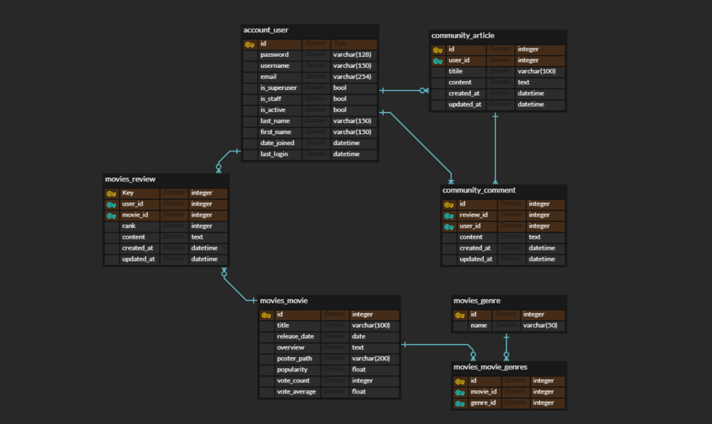

# Final Project

## 구성원 및 역할

- 이종준(팀장): 커뮤니티 기능 구현
- 이승규: 회원인증 기능 구현
- 공통: 영화추천 기능 구현, UI/UX 향상

## 프로젝트 목표

- 넷플릭스를 오마주하여 UI/UX를 비슷하게 구성
- 요구사항에 충실하게, 필요한 기능만 간단명료하게 구현

## Project Log

11.17 (수) 1일차 진행 상황:

- 프로젝트 기획 및 페이지 초안 작성
- ERD 작성
- back, front 프로젝트 및 앱 생성
- 필요한 기초작업 수행

11.18 (목) 2일차 진행 상황:

- 영화 데이터를 django db에 저장
- Home에 각 영화 정보를 bootstrap card component를 이용해 보여주는 기능 구현
- 로그인기능 구현 및 커뮤니티 게시판 작성 기능 구현

11.19(금) 3일차 진행 상황:

- 로그아웃 기능 구현, 로그인 여부에 따른 토글 기능 추가 완료 => 회원인증 기능 구현 완료
- 커뮤니티 CRUD 기능 구현 완료

11.22(월) 4일차 진행 상황:

- 커뮤니티 댓글 기능 구현 - 완료
- 영화 세부정보 페이지 기능 구현 - 완료

11.23(화) 5일차 진행 상황:

- 영화추천 기능 구현 - 완료
- 서비스 디자인 완성도 높이기

11.24(수) 6일차 진행 상황:

- 서비스 디자인 완성
- 프로젝트 마무리

11.25(목) 7일차 진행 상황:

- 프로젝트 발표 준비 완료
- 프로젝트 배포 완료
- 지속적인 피드백 및 프로젝트 완성도 높이기

## 데이터베이스 모델링(ERD)

## 프로젝트 기능

- 영화 정보:
  - TMDB로부터 약 400개의 영화 데이터 수집하여 카드 형태로 보여줌
  - 모든 로그인된 유저는 영화에 대한 평점 등록 및 삭제 가능

- 알고리즘 기반 영화 추천 기능:
  - 영화 자체 평점과 회원들이 직접 작성한 평점을 비교, 회원이 직접 작성한 평점이 더 높은 영화를 추천
  - 로그인한 사람이 평점을 4점 이상으로 남긴 영화들의 장르를 모아서 비슷한 장르의 영화를 평점순으로 추천

- 커뮤니티:
  - 영화 정보와 관련된 다양한 대화를 할 수 있는 자유게시판 기능 구현
  - 로그인한 사용자만 글 조회 및 생성, 작성자 본인만 글 수정 및 삭제 가능
  - 게시글에 댓글 작성 및 작성자 본인만 댓글 삭제 가능

## Project URL

- https://nervous-minsky-7d3685.netlify.app

## 관통프로젝트를 마치며

솔직히 처음엔 프로젝트를 만만하게 생각했다. 이제까지 금요일마다 해오던 것들을 종합하면 된다는 교수님의 말씀이 우리를 안일하게 만들었던 것 같다.

하지만, 프로젝트 기획부터 배포까지 모든 것을 교수님의 도움 없이 오직 함께 하는 팀원과 함께 해나가는 것이 보통 일이 아니라는 것을 느꼈다. 프로젝트를 진행하면서 수없이 많은 에러들을 접했고, 그 에러를 분석하고 고쳐나가는 데 시간이 꽤 오래 걸리고 고쳐지지 않았을 때의 스트레스도 꽤 컸다.

하지만 이런 과정들을 거치면서 많은 것을 배울 수 있었다. 프로젝트의 기획부터 배포까지 그 모든 과정을 경험했다는 점에서 큰 보람을 느꼈고, 함께 프로젝트를 진행한 동료에게도 매우 감사함을 느꼈다. 